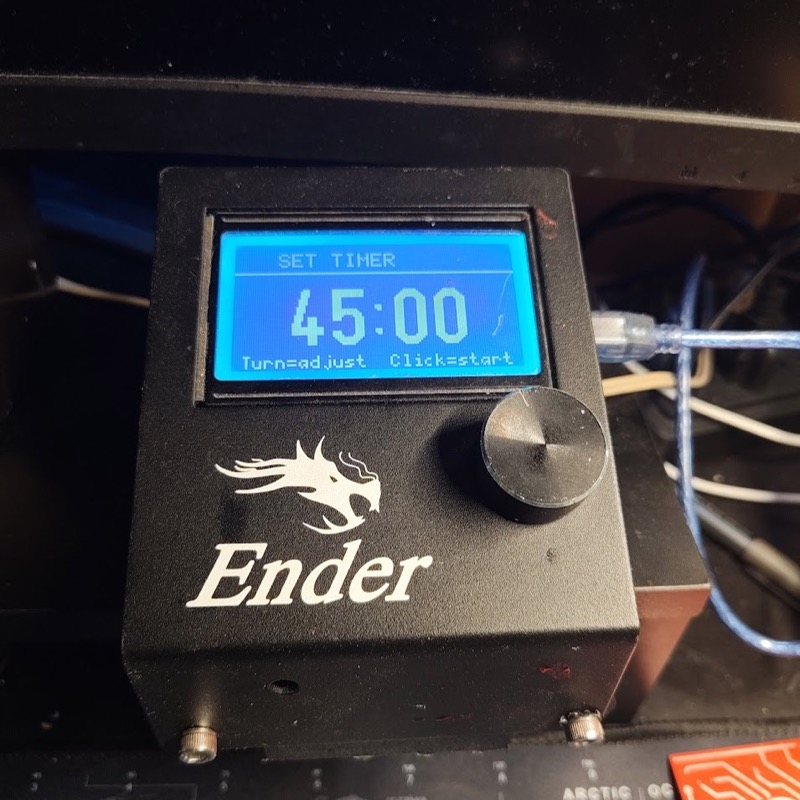
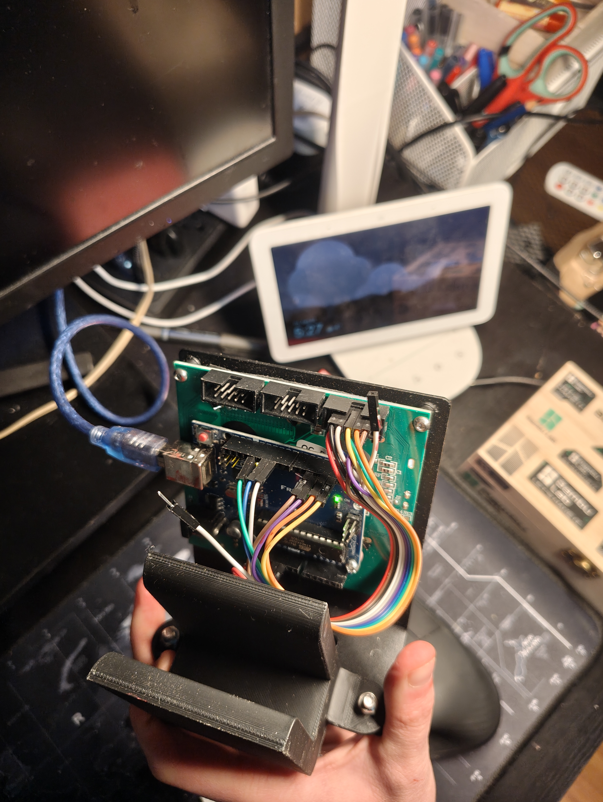

# Ender 3 Display Task Timer
### ST7920 ENH12864Z-1 + Arduino Uno

A standalone task timer using the Creality Ender 3 display (ENH12864Z-1) wired to an Arduino Uno via the EXP3 connector.

---

## Photos

<p>
  
  
</p>

---

## Hardware

- **Display:** Creality ENH12864Z-1 (ST7920, 128×64 monochrome LCD)
- **Microcontroller:** Arduino Uno (USB 5V powered)
- **Library:** U8g2 (install via Arduino Library Manager)

---

## Display Connector Overview

The ENH12864Z-1 has three connectors on the back:

| Connector | Purpose |
|-----------|---------|
| EXP1 | Parallel LCD data + encoder click + buzzer |
| EXP2 | SPI + SD card + encoder rotation |
| EXP3 | Combined single-cable SPI interface (used in this project) |

> **EXP3 is used for this project** — it combines all needed signals into one connector, reducing wiring from 13 wires down to 9.

---

## EXP3 Pinout

EXP3 is a 2×5 (10-pin) 2.54mm pitch IDC connector.

```
    NOTCH
  ┌───────┐
  │ 2  1  │  ← Pin 1 marked with dot/triangle on PCB
  │ 4  3  │
  │ 6  5  │
  │ 8  7  │
  │ 10  9 │
  └───────┘
  Odd  = right column
  Even = left column
```

| Pin | Signal | Wire Color | Description |
|-----|--------|------------|-------------|
| 1 | GND | Black | Ground |
| 2 | CS | Grey | SPI Chip Select |
| 3 | Knob Rotation 1 | Yellow | Encoder channel A |
| 4 | Knob Rotation 2 | Orange | Encoder channel B |
| 5 | Beeper | Red | Buzzer signal |
| 6 | — | — | Not used |
| 7 | 5V | Brown | Power |
| 8 | Data (MOSI) | Blue | SPI data |
| 9 | Clock (SCK) | Green | SPI clock |
| 10 | Knob Button | Purple | Encoder push button |

---

## Wiring — EXP3 to Arduino Uno

| EXP3 Pin | Signal | Wire Color | Arduino Uno Pin |
|----------|--------|------------|-----------------|
| 1 | GND | Black | GND |
| 2 | Chip Select | Grey | D10 |
| 3 | Knob Rotation 1 | Yellow | D2 |
| 4 | Knob Rotation 2 | Orange | D3 |
| 5 | Beeper | Red | D5 |
| 7 | 5V | Brown | 5V |
| 8 | Data (MOSI) | Blue | D11 |
| 9 | Clock (SCK) | Green | D13 |
| 10 | Knob Button | Purple | D4 |

> **Note:** Pin 6 is not connected. Only 9 of the 10 pins are used.

---

## Power

The Arduino Uno is powered via USB (5V). The display draws approximately:

| Component | Current Draw |
|-----------|-------------|
| ST7920 LCD | ~20mA |
| Backlight | ~40mA |
| Buzzer (peak) | ~30mA |
| Encoder | ~5mA |
| Arduino Uno | ~50mA |
| **Total** | **~145mA** |

A standard USB port provides 500mA — well within limits.

---

## Wiring Notes

- All connectors are **2.54mm pitch** (standard Dupont spacing)
- Use **female-to-female Dupont jumper wires** to connect individual EXP3 pins to Arduino headers
- Alternatively, use a **10-pin IDC to Dupont breakout cable** for a cleaner connection
- **Pin 1** on EXP3 is marked with a dot or triangle on the PCB
- The connector has a **keying notch** — ensure ribbon cables are inserted in the correct orientation

---

## Connector Identification — How to Find Pin 1

1. Look at the back of the display PCB
2. Find the small **triangle (▲) or dot (•)** printed next to one corner of the connector
3. That corner is **Pin 1**
4. Pins are numbered with **odd numbers on the right** and **even numbers on the left**, counting down from the top

---

## Software Setup

1. Install **Arduino IDE**
2. Open Library Manager (`Tools → Manage Libraries`)
3. Search for **U8g2** and install
4. Open `task_timer.ino`
5. Select `Board: Arduino Uno` and correct COM port
6. Upload

---

## Timer Operation

| State | Action | Input |
|-------|--------|-------|
| **Setting** | Turn encoder to adjust time | Rotate knob (5 min increments) |
| **Setting** | Start timer | Click knob |
| **Running** | Pause timer | Click knob |
| **Paused** | Resume timer | Short click |
| **Paused** | Reset to setting | Hold knob 1 second |
| **Done** | Set new timer | Click knob |

The default time is **45 minutes**. The display shows a **progress bar** while the timer is running. The buzzer beeps **3 times** when the timer reaches zero.

---

## Pin Summary (Arduino Uno)

| Arduino Pin | Function |
|-------------|----------|
| 5V | Display power |
| GND | Ground (shared) |
| D2 | Encoder A (interrupt) |
| D3 | Encoder B (interrupt) |
| D4 | Encoder button |
| D5 | Buzzer |
| D10 | SPI Chip Select |
| D11 | SPI MOSI (data) |
| D13 | SPI SCK (clock) |

---

## Files

| File | Description |
|------|-------------|
| `task_timer/task_timer.ino` | Arduino sketch |
| `ender-front.jpg` | Display front view |
| `ender-back.jpg` | Display back view (connectors) |
| `README.md` | This file |
